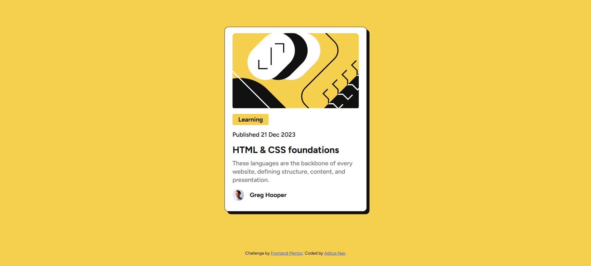
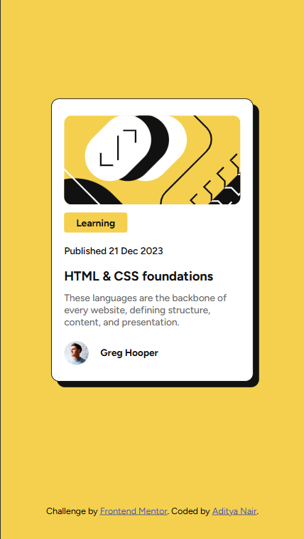

# Frontend Mentor - Blog preview card solution

This is a solution to the [Blog preview card challenge on Frontend Mentor](https://www.frontendmentor.io/challenges/blog-preview-card-ckPaj01IcS). Frontend Mentor challenges help you improve your coding skills by building realistic projects.

## Table of contents

- [Overview](#overview)
  - [The challenge](#the-challenge)
  - [Screenshot](#screenshot)
  - [Links](#links)
- [My process](#my-process)
  - [Built with](#built-with)
  - [What I learned](#what-i-learned)
  - [Continued development](#continued-development)
- [Author](#author)

**Note: Delete this note and update the table of contents based on what sections you keep.**

## Overview

### The challenge

Users should be able to:

- See hover and focus states for all interactive elements on the page

### Screenshot

#### Desktop View

#### Mobile View

### Links

- Solution URL: [Solution](https://www.frontendmentor.io/solutions/)
- Live Site URL: [Live Link]()

## My process

### Built with

- Semantic HTML5 markup
- CSS custom properties
- Flexbox
- Mobile-first workflow

### What I learned

- box-shadow property to give shadow to an element
- media queries to render different styles on various device screens
- css variables for code reusability
- make use of local fonts in the project

### Continued development

- enhance flexbox usage
- deeply study svg and their effective usage
- work on more responsive designing

### Author

- Website - [Aditya Nair](https://adityanair07.netlify.app/)
- Frontend Mentor - [@AdityaNair07](https://www.frontendmentor.io/profile/AdityaNair07)
