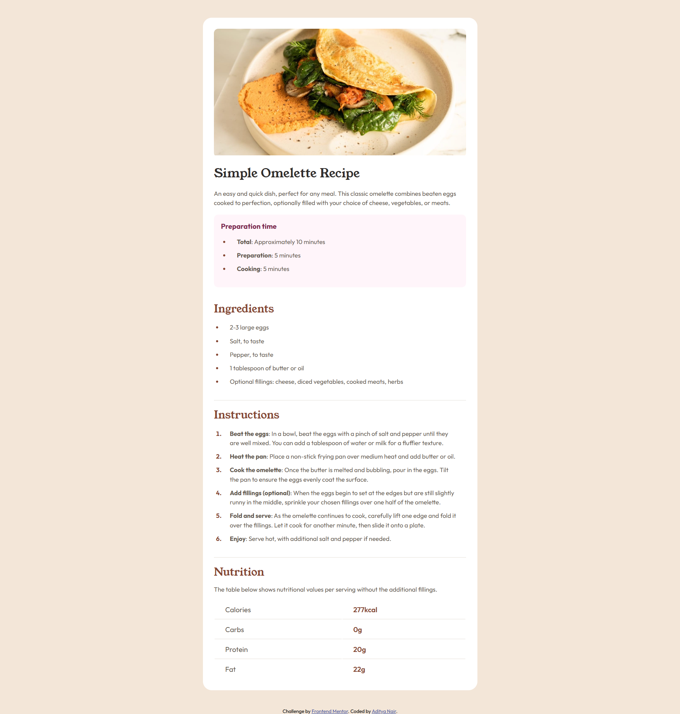

# Frontend Mentor - Recipe page solution

This is a solution to the [Recipe page challenge on Frontend Mentor](https://www.frontendmentor.io/challenges/recipe-page-KiTsR8QQKm). Frontend Mentor challenges help you improve your coding skills by building realistic projects.

## Table of contents

- [Overview](#overview)
  - [Screenshot](#screenshot)
  - [Links](#links)
- [My process](#my-process)
  - [Built with](#built-with)
- [Author](#author)

## Overview

### Screenshot

- Desktop view

- Mobile view

### Links

- Solution URL: [Solution](https://adityanair07.github.io/frontend-mentor-challenges/recipe-page-main)
- Live Site URL: [Live](https://adityanair07.github.io/frontend-mentor-challenges/recipe-page-main)

## My process

### Built with

- HTML
- CSS custom properties

## Author

- Website - [Aditya Nair](https://adityanair07.netlify.app/)
- Frontend Mentor - [@AdityaNair07](https://www.frontendmentor.io/profile/AdityaNair07)
- LinkedIn - [Aditya Nair](https://www.linkedin.com/in/aditya-nair-766875229/)
